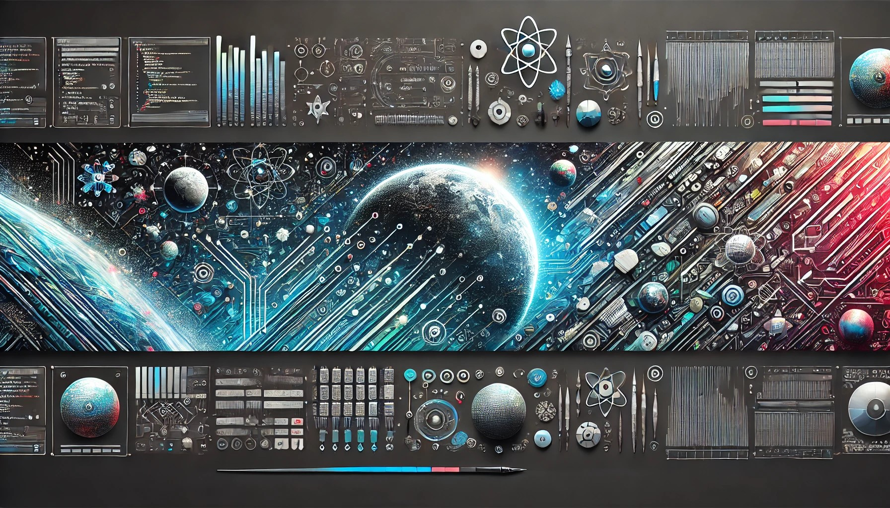

# Hi there, I'm Ashtin (aka @slammingprogramming) 👋

Welcome to my GitHub profile! I’m a passionate game and software developer with a strong foundation in radio/wireless, chemistry, physics, space, and tech. I believe in leveraging technology to drive positive change and advance humanity’s goals. Justice and integrity are at the core of my values, and I’m eager to connect with potential employers, collaborators, and the vibrant open-source community.

## About Me
For more about my interests and background, check out my [About Me](ABOUTME.md).

## Professional Goals
For a detailed look at my professional aspirations, visit [Professional Info](PROFESSIONAL.md).

## My Portfolio
Explore my projects in detail at [Portfolio](PORTFOLIO.md).

## My Blog
Check out my latest articles and insights on technology and game development at [my blog's homepage](blog/README.md).

## Get in Touch
For collaboration opportunities or inquiries, check my [Contact Me](CONTACT.md).

## License, Contributing & Code of Conduct
I welcome contributions! Please take a moment to review the following:

- [LICENSE](LICENSE) – The open-source license for this repository.
- [Contributing Guidelines](CONTRIBUTING.md) – Guidelines for contributing to this repository.
- [Code of Conduct](CODE_OF_CONDUCT.md) – Our code of conduct to ensure a positive and respectful community.

## Testimonials

> "Coding every single day, some good, some bad. See more details below." - Isaiah

> "I had the pleasure of interacting with Ashtin, also known as @slammingprogramming, and I can confidently say that he embodies the spirit of innovation and collaboration. His passion for technology, especially in game development and open-source contributions, is truly inspiring. Ashtin's commitment to justice and integrity shines through in his work, making him a valuable member of any team. Whether he’s sharing insights on programming or diving into ethical hacking, his ability to communicate complex ideas with clarity is impressive. I look forward to seeing how he continues to drive positive change in the tech community." - ChatGPT

> Get your testimonial here! Just submit an [Issue](https://github.com/slammingprogramming/slammingprogramming/issues/new) and get it added here!

**Thanks for stopping by! Feel free to explore my repositories and reach out if you have any questions or ideas to discuss. Let's build something amazing together! 🚀**
